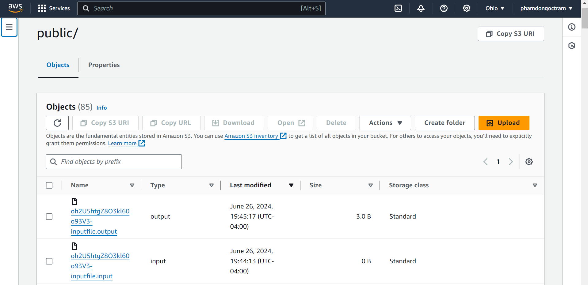

# AWS File Upload

## What I Have Learned

I quickly self-taught myself how each technology works and interacts with othersfor this coding challenge by referring to online resources and AWS documentation (references below).

## Next Steps

To further enhance this project, I plan to:

- Improve Responsive UI with Flowbite Tailwind CSS and more user-friendly authentication.
- One user has one folder on S3 bucket and no one can access other user's folder.
- Implement a notification system to inform users when file processing is complete.
- Explore using more AWS service to manage the workflow more effectively.

## To Run the Project

Clone my repo and cd to ```frontend``` folder. Follow these commands to set up and run the project:

### 1. Install Dependencies

```bash
npm install
npm start
npm install -g @aws-amplify/cli
amplify configure
```

### 2. Configure AWS Amplify

Follow instructions from [here](https://docs.amplify.aws/gen1/javascript/tools/cli/start/set-up-cli/#configure-the-amplify-cli) to create an IAM user and get access keys.

```bash
# Follow these steps to set up access to your AWS account:

# Sign in to your AWS administrator account:
https://console.aws.amazon.com/

# Specify the AWS Region
? region:  us-east-2

# Follow the instructions at
https://docs.amplify.aws/cli/start/install/#configure-the-amplify-cli

# Complete the user creation in the AWS console
https://console.aws.amazon.com/iamv2/home#/users/create

# Enter the access key of the newly created user:
? accessKeyId:  ********************
? secretAccessKey:  ****************************************

# This would update/create the AWS Profile in your local machine
? Profile Name:  your-profile-name

# Successfully set up the new user.
```

### 3. Initialize Amplify

After you successfully set up the new user:

```bash
amplify init

? Enter a name for the environment: dev
? Choose your default editor: Visual Studio Code
Using default provider awscloudformation
? Select the authentication method you want to use: AWS access keys
? accessKeyId:  ********************
? secretAccessKey:  ****************************************
? region:  us-east-2
```

### 4. Run the Application

You can now create an account and sign in to the app. You will receive a code in your email to verify your account.

```bash
npm start
```

Upon successful file upload, you will get an alert that your file is uploaded successfully.

## Screenshots

- **Home Page**: 
- **File Upload Form**: 
- **S3 Bucket View**: 
- **DynamoDB Entry**: 
- **EC2 Instance Logs**: 

## References

- [Install Flowbite](https://flowbite.com/docs/getting-started/react/)
- [AWS Amplify & Cognito](https://docs.aws.amazon.com/prescriptive-guidance/latest/patterns/create-a-react-app-by-using-aws-amplify-and-add-authentication-with-amazon-cognito.html)
- [Follow this to create access key](https://docs.amplify.aws/gen1/javascript/tools/cli/start/set-up-cli/#configure-the-amplify-cli)
- [Amplify upload from file](https://docs.amplify.aws/javascript/build-a-backend/storage/upload-files/)
- [Serverless Web App](https://aws.amazon.com/getting-started/hands-on/build-serverless-web-app-lambda-apigateway-s3-dynamodb-cognito/module-3/)
- [DynamoDB & Lambda & API](https://docs.aws.amazon.com/apigateway/latest/developerguide/http-api-dynamo-db.html)

---
